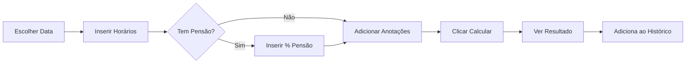

<div align="center">

# 📊 VidaExtra® – Calculadora AC-4

### Aplicação PWA para cálculo profissional de horas extras (AC-4)


</div>

---

## 📑 Índice

- [Sobre o Projeto](#-sobre-o-projeto)
- [Recursos Principais](#-recursos-principais)
- [Tecnologias Utilizadas](#-tecnologias-utilizadas)
- [Pré-requisitos](#-pré-requisitos)
- [Instalação](#-instalação)
- [Configuração](#-configuração)
- [Como Usar](#-como-usar)
- [Scripts Disponíveis](#-scripts-disponíveis)
- [Estrutura do Projeto](#-estrutura-do-projeto)
- [Qualidade de Código](#-qualidade-de-código)
- [Novidades Recentes](#-novidades-recentes)
- [Contribuindo](#-contribuindo)
- [Suporte](#-suporte)
- [Créditos](#-créditos)

---

## 📖 Sobre o Projeto

**VidaExtra®** é uma Progressive Web App (PWA) desenvolvida para facilitar o cálculo de horas extras no formato AC-4, voltada para profissionais da segurança pública. A aplicação oferece uma interface intuitiva, cálculos precisos baseados em tabelas configuráveis e recursos avançados como histórico, edição de registros, calendário visual e exportação em PDF.

### 🎯 Objetivo

Simplificar e automatizar o cálculo de horas extras, permitindo aos usuários:
- Registrar operações com data, horários e anotações
- Visualizar histórico completo em lista e calendário
- Aplicar descontos de pensão alimentícia automaticamente
- Exportar relatórios em PDF para prestação de contas
- Acessar offline através da tecnologia PWA

---

## ✨ Recursos Principais

### 📝 Formulário Inteligente
- **Seleção de Data**: Escolha a data do serviço com calendário visual
- **Horários Flexíveis**: Entrada de hora inicial e final (suporte a plantões noturnos)
- **Anotações Personalizadas**: Campo de texto para observações importantes
- **Desconto de Pensão**: Cálculo automático com percentual configurável

### 📊 Cálculos Automáticos
- **Valores por Dia da Semana**: Tabela diferenciada (segunda a domingo)
- **Cálculo de Horas**: Automatizado com suporte a períodos que atravessam meia-noite
- **Descontos**: Aplicação automática de percentual de pensão alimentícia
- **Totalizadores**: Acompanhamento de horas acumuladas e valores (bruto/líquido)

### 📅 Calendário Visual
- **FullCalendar Integrado**: Visualização mensal e semanal dos registros
- **Indicadores Visuais**: 
  - Borda azul para eventos de hoje
  - Borda vermelha para eventos futuros
- **Tooltips Informativos**: Hover/toque para ver detalhes sem abrir o registro
- **Responsivo**: Ajuste automático ao alternar entre abas

### 📋 Histórico Completo
- **Lista Ordenada**: Registros organizados por data crescente
- **Edição em Linha**: Modifique data, horários, pensão e anotações
- **Remoção Seletiva**: Delete registros individuais com confirmação
- **Totalizadores Dinâmicos**: Atualização automática de horas e valores
- **Persistência Local**: Dados salvos no navegador (localStorage)

### 📄 Exportação PDF
- **Layout Profissional**: Tabela formatada com cabeçalho e rodapé
- **Informações Completas**: Data, período, anotações, horas e valores
- **Totalizadores**: Horas acumuladas, valores bruto/líquido e descontos
- **Nome Automático**: Arquivo gerado com data no formato `historico_ac4_YYYY-MM-DD.pdf`

### 🎵 Feedback Sonoro
- **Som de Confirmação**: Bip agradável ao adicionar registro
- **Som de Limpeza**: Efeito decrescente ao limpar todos os dados
- **Som de Exclusão**: Bip curto ao remover item individual

### 📱 PWA (Progressive Web App)
- **Instalável**: Adicione à tela inicial do smartphone ou desktop
- **Offline**: Funciona sem internet após primeira carga
- **Service Worker**: Cache inteligente de recursos estáticos
- **Manifest Configurado**: Ícones, cores e orientação otimizados

---

## 🛠️ Tecnologias Utilizadas

### Frontend

| Tecnologia | Versão | Descrição |
|------------|--------|-----------|
| **Bootstrap** | 5.3.0 | Framework CSS para layout responsivo e componentes |
| **Bootstrap Icons** | 1.10.0 | Biblioteca de ícones para interface |
| **Tailwind CSS** | 4.1.16 | Utilitários CSS modernos para estilização |
| **FullCalendar** | 6.1.10 | Calendário interativo com eventos |
| **Luxon** | 3.x | Manipulação e formatação de datas |
| **SweetAlert2** | 11.x | Modais e diálogos elegantes |
| **html2pdf.js** | 0.10.1 | Geração de PDF a partir de HTML |

### Build & Qualidade

| Ferramenta | Versão | Descrição |
|------------|--------|-----------|
| **ESLint** | 9.38.0 | Linter para qualidade e padrões de código JavaScript |
| **PostCSS** | 8.5.6 | Processador CSS para otimizações |
| **Autoprefixer** | 10.4.21 | Adiciona prefixos vendor automaticamente |
| **Serve** | 14.2.5 | Servidor HTTP estático para desenvolvimento |

### PWA

| Recurso | Descrição |
|---------|-----------|
| **Service Worker** | Cache offline e estratégia cache-first |
| **Web Manifest** | Configuração de instalação e aparência |
| **LocalStorage** | Persistência de dados no navegador |

---

## 📋 Pré-requisitos

Antes de começar, certifique-se de ter instalado em sua máquina:

- **Node.js** v16 ou superior ([Download](https://nodejs.org/))
- **npm** v7 ou superior (incluído com Node.js)
- **Git** (opcional, para versionamento) ([Download](https://git-scm.com/))
- **Navegador moderno**: Chrome, Firefox, Edge ou Safari

### Verificando as instalações

```powershell
node --version   # deve mostrar v16.x.x ou superior
npm --version    # deve mostrar v7.x.x ou superior
git --version    # deve mostrar git version x.x.x
```

---

## 🚀 Instalação

### 1. Clone ou baixe o repositório

```powershell
# Via Git
git clone https://github.com/Ald3b4r4n/VidaExtra.git
cd VidaExtra

# Ou baixe e extraia o ZIP manualmente
```

### 2. Instale as dependências

```powershell
npm install
```

Este comando irá:
- Instalar todas as dependências listadas em `package.json`
- Executar automaticamente `npm run build:css` via script `postinstall`
- Gerar o arquivo `dist/tailwind.css` minificado

### 3. Verifique a instalação

```powershell
# Deve existir a pasta node_modules e o arquivo dist/tailwind.css
ls node_modules
ls dist
```

---

## ⚙️ Configuração

### Estrutura Tailwind CSS

O projeto usa Tailwind CSS v4 com compilação via CLI. Os arquivos de configuração são:

#### `tailwind.config.js`
```javascript
module.exports = {
  content: ['./index.html', './app.js', './dashboard-preview.html', './dashboard-alt-preview.html', './dashboard-a-preview.html'],
  theme: {
    extend: {
      colors: {
        'primary': '#0d6efd',
        'success': '#198754',
        'danger': '#dc3545',
        'warning': '#ffc107',
      }
    }
  },
  plugins: [],
};
```

#### `postcss.config.js`
```javascript
module.exports = {
  plugins: {
    tailwindcss: {},
    autoprefixer: {},
  }
}
```

#### `src/input.css`
```css
@tailwind base;
@tailwind components;
@tailwind utilities;

/* Customizações globais podem ser adicionadas aqui */
```

### Configuração ESLint

O projeto usa ESLint 9 com flat config:

#### `eslint.config.cjs`
```javascript
module.exports = [
  {
    files: ['**/*.js'],
    languageOptions: {
      ecmaVersion: 2021,
      sourceType: 'script',
      globals: {
        window: 'readonly',
        document: 'readonly',
        console: 'readonly',
        localStorage: 'readonly',
        Swal: 'readonly',
        html2pdf: 'readonly',
        bootstrap: 'readonly'
      }
    },
    rules: {
      'no-unused-vars': ['warn', { 'args': 'none' }],
      'no-console': 'off',
      'semi': ['error', 'always'],
      'quotes': ['warn', 'single']
    }
  }
];
```

#### `.eslintignore`
```
node_modules/
dist/
*.min.js
```

### Valores AC-4

Os valores por dia da semana são configurados em `valores-ac4.json`:

```json
{
  "valores": [
    {
      "horario": "18h as 00h (6h)",
      "horas": 6,
      "segunda": 279.40,
      "terca": 279.40,
      "quarta": 279.40,
      "quinta": 279.40,
      "sexta": 279.40,
      "sabado": 344.90,
      "domingo": 417.07
    },
    // ... mais horários
  ]
}
```

**Campos:**
- `horario`: Formato de exibição (aceita `_` ou espaços)
- `horas`: Total de horas do período
- `segunda` a `domingo`: Valores monetários por dia da semana

---

## 📖 Como Usar

### Iniciando o Servidor

```powershell
# Opção 1: Usando npm start
npm start

# Opção 2: Diretamente com serve
npm run serve

# O servidor iniciará na porta 5500
# Acesse: http://localhost:5500
```

### Fluxo de Uso

#### 1. **Adicionar um Cálculo**

<div align="center">



</div>

1. Selecione a **data** do serviço
2. Informe a **hora inicial** (ex: 18:00)
3. Informe a **hora final** (ex: 00:00)
4. *(Opcional)* Marque "Pensão Alimentícia" e informe o percentual
5. *(Opcional)* Adicione anotações (local, tipo de operação, etc.)
6. Clique em **"Calcular"**
7. Visualize o resultado na aba "Resultado"
8. O registro é adicionado automaticamente ao histórico

#### 2. **Visualizar Histórico**

- **Lista**: Todos os registros ordenados por data crescente
- **Calendário**: Clique na aba "Histórico" para ver a visualização mensal/semanal
- **Tooltips**: Passe o mouse (ou toque em mobile) sobre os dias com eventos

#### 3. **Editar um Registro**

1. Localize o item no histórico
2. Clique no **ícone de lápis** (📝)
3. Modifique os campos desejados
4. Clique em **"Salvar"**
5. Os totais são recalculados automaticamente

#### 4. **Remover um Registro**

1. Localize o item no histórico
2. Clique no **ícone X** (✖️)
3. Confirme a remoção
4. Os totais são atualizados automaticamente

#### 5. **Exportar PDF**

1. Certifique-se de ter registros no histórico
2. Clique em **"Exportar PDF"**
3. Aguarde a geração
4. O arquivo será baixado automaticamente com nome `historico_ac4_YYYY-MM-DD.pdf`

#### 6. **Limpar Tudo**

1. Clique em **"Limpar Tudo"**
2. Confirme a ação
3. Todos os dados (resultado + histórico) serão apagados

---

## 📜 Scripts Disponíveis

### Scripts de Build

```powershell
# Compilar Tailwind CSS (minificado para produção)
npm run build:css

# Compilar Tailwind CSS em modo watch (desenvolvimento)
npm run dev:css
```

### Scripts de Servidor

```powershell
# Iniciar servidor estático na porta 5500
npm run serve

# Alias para npm run serve
npm start
```

### Scripts de Qualidade

```powershell
# Executar ESLint em todos os arquivos .js
npm run lint

# Executar ESLint com correção automática
npm run lint -- --fix
```

### Scripts Automáticos

```powershell
# Executado automaticamente após npm install
npm run postinstall  # = npm run build:css
```

---

## 📂 Estrutura do Projeto

```
VidaExtra/
│
├── 📁 src/
│   └── input.css                    # Arquivo fonte Tailwind
│
├── 📁 dist/
│   └── tailwind.css                 # CSS compilado e minificado
│
├── 📁 node_modules/                 # Dependências (não versionado)
│
├── 📄 index.html                    # Página principal da aplicação
├── 📄 app.js                        # Lógica principal (ES2021)
├── 📄 style.css                     # Estilos customizados complementares
│
├── 📄 dashboard-preview.html        # Preview alternativo 1
├── 📄 dashboard-alt-preview.html    # Preview alternativo 2
├── 📄 dashboard-a-preview.html      # Preview alternativo 3
├── 📄 index.backup-opcaoA.html      # Backup de versão anterior
│
├── 📄 valores-ac4.json              # Tabela de valores por dia/horário
│
├── 📄 manifest.json                 # Manifesto PWA
├── 📄 sw.js                         # Service Worker
│
├── 📄 package.json                  # Configuração do projeto e dependências
├── 📄 package-lock.json             # Lock de versões das dependências
│
├── 📄 tailwind.config.js            # Configuração Tailwind CSS
├── 📄 postcss.config.js             # Configuração PostCSS
├── 📄 eslint.config.cjs             # Configuração ESLint (flat config)
│
└── 📄 README.md                     # Este arquivo
```

### Arquivos Principais

#### `index.html`
Página principal da aplicação com:
- Importação de bibliotecas via CDN (Bootstrap, FullCalendar, etc.)
- Estrutura HTML semântica
- Sistema de abas (Cálculo, Resultado, Histórico)
- Links para folhas de estilo

#### `app.js`
Código principal com:
- Carregamento de valores do JSON
- Funções de cálculo de horas extras
- Gerenciamento de histórico (adicionar, editar, remover)
- Integração com FullCalendar
- Geração de PDF
- Persistência em localStorage
- Feedback sonoro

#### `valores-ac4.json`
Tabela de valores configurável:
- Horários pré-definidos
- Valores diferenciados por dia da semana
- Total de horas por período

#### `sw.js` (Service Worker)
Estratégia de cache:
- Cache-first para recursos estáticos
- Atualização em background
- Suporte offline

---

## 🔍 Qualidade de Código

### Padrões ESLint

O projeto segue o `eslint:recommended` com adaptações:

- **ECMAVersion**: ES2021
- **SourceType**: Script (compatível com browsers)
- **Globals**: `Swal`, `html2pdf`, `bootstrap`, `FullCalendar`, `luxon`
- **Rules**:
  - `no-unused-vars`: Aviso (permite parâmetros não usados)
  - `no-console`: Desligado (permite logs)
  - `semi`: Erro (exige ponto-e-vírgula)
  - `quotes`: Aviso (prefere aspas simples)

### Executando Validação

```powershell
# Verificar erros e avisos
npm run lint

# Corrigir problemas automaticamente
npm run lint -- --fix
```

### Boas Práticas

- ✅ Usar `const` e `let` (evitar `var`)
- ✅ Nomear funções e variáveis de forma descritiva
- ✅ Comentar seções e lógicas complexas
- ✅ Evitar aninhamento excessivo (máx 3 níveis)
- ✅ Validar inputs do usuário
- ✅ Tratar erros com try/catch
- ✅ Usar arrow functions quando apropriado

---

## 🆕 Novidades Recentes

### Versão 1.0.0 (Novembro 2024)

#### 🎨 Melhorias no Calendário
- ✨ Eventos no mês aparecem como **texto simples** por dia (sem barras atravessando)
- 🎨 **Borda visual** nos dias com eventos:
  - **Azul** para eventos de hoje
  - **Vermelho** para eventos futuros
- 🌐 Rótulos totalmente em **português**: `mês`, `semana`, `hoje`
- 🔧 Correção de renderização ao alternar para aba Histórico (recalcula tamanho)

#### 📝 Funcionalidade de Edição
- ✏️ **Edição completa** de registros do histórico
- 🔄 Recálculo automático de totais após edição
- 💾 Atualização em tempo real no calendário e lista

#### 🎵 Feedback Sonoro
- 🔔 Som de confirmação ao adicionar cálculo
- 🧹 Som de limpeza ao resetar dados
- 🗑️ Som de exclusão ao remover item

#### 🐛 Correções
- 🔧 Overflow de texto nos quadrados do calendário
- 🔧 Sincronização entre lista e calendário
- 🔧 Persistência de dados após edição
- 🔧 Formatação de horários no JSON (aceita `_` e espaços)

---

## 🤝 Contribuindo

Contribuições são bem-vindas! Para contribuir:

### 1. Fork o repositório
```powershell
# No GitHub, clique em "Fork"
```

### 2. Clone seu fork
```powershell
git clone https://github.com/SEU-USUARIO/VidaExtra.git
cd VidaExtra
```

### 3. Crie uma branch para sua feature
```powershell
git checkout -b feature/minha-nova-feature
```

### 4. Faça suas alterações
```powershell
# Edite os arquivos
npm run lint          # Verifique a qualidade
npm run build:css     # Compile o CSS se necessário
```

### 5. Commit e Push
```powershell
git add .
git commit -m "feat: adiciona nova funcionalidade X"
git push origin feature/minha-nova-feature
```

### 6. Abra um Pull Request
- No GitHub, vá até seu fork
- Clique em "New Pull Request"
- Descreva suas alterações detalhadamente

### Diretrizes

- ✅ Mantenha o código limpo e documentado
- ✅ Siga os padrões ESLint do projeto
- ✅ Teste suas alterações antes do commit
- ✅ Use commits semânticos (`feat:`, `fix:`, `docs:`, `style:`, `refactor:`)
- ✅ Não inclua `node_modules` ou `dist` no commit
- ✅ Atualize o README se adicionar novos recursos

---

## 💬 Suporte

### Problemas Comuns

#### ❓ "Horário não encontrado"
**Solução**: Verifique se o horário existe em `valores-ac4.json`. O formato deve ser exato (ex: `18h as 00h`).

#### ❓ "Valores não carregados"
**Solução**: Certifique-se de que o arquivo `valores-ac4.json` está na raiz do projeto e é um JSON válido.

#### ❓ Tailwind CSS não aplica estilos
**Solução**: Execute `npm run build:css` para gerar o arquivo `dist/tailwind.css`.

#### ❓ Erros de ESLint
**Solução**: Execute `npm run lint -- --fix` para corrigir automaticamente.

#### ❓ PWA não instala
**Solução**: Certifique-se de estar acessando via HTTPS ou localhost. Verifique o console do navegador.

### Contato

- **Desenvolvedor**: CB Antônio Rafael - 14ª CIPM
- **GitHub**: [Ald3b4r4n](https://github.com/Ald3b4r4n)
- **Repositório**: [VidaExtra](https://github.com/Ald3b4r4n/VidaExtra)

---

## 🏆 Créditos

### Desenvolvedor Principal
- **CB Antônio Rafael** - Desenvolvedor Full Stack
- Lotação: 14ª CIPM

### Tecnologias de Terceiros

Este projeto utiliza as seguintes bibliotecas open-source:

- [Bootstrap](https://getbootstrap.com/) - Framework CSS
- [Bootstrap Icons](https://icons.getbootstrap.com/) - Ícones
- [Tailwind CSS](https://tailwindcss.com/) - Utilitários CSS
- [FullCalendar](https://fullcalendar.io/) - Calendário interativo
- [Luxon](https://moment.github.io/luxon/) - Manipulação de datas
- [SweetAlert2](https://sweetalert2.github.io/) - Modais elegantes
- [html2pdf.js](https://ekoopmans.github.io/html2pdf.js/) - Geração de PDF
- [ESLint](https://eslint.org/) - Linter JavaScript
- [PostCSS](https://postcss.org/) - Processador CSS
- [Serve](https://github.com/vercel/serve) - Servidor estático

### Agradecimentos

- Comunidade open-source por disponibilizar ferramentas incríveis
- Colegas da 14ª CIPM pelos feedbacks e testes
- Usuários finais que utilizam e confiam na aplicação

---

## 📄 Licença

**Uso Interno** - Sem licença pública definida.

Este projeto é desenvolvido para uso interno da instituição. 
Todos os direitos reservados © 2024 VidaExtra®

---

<div align="center">

### ⭐ Se este projeto foi útil, considere dar uma estrela no GitHub!

**[⬆️ Voltar ao topo](#-vidaextra--calculadora-ac-4)**

Desenvolvido com ❤️ por **CB Antônio Rafael**

</div>
