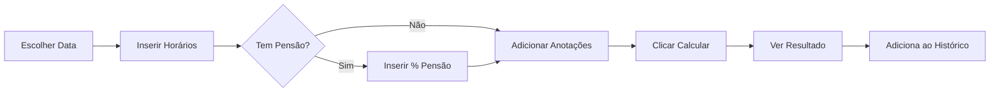
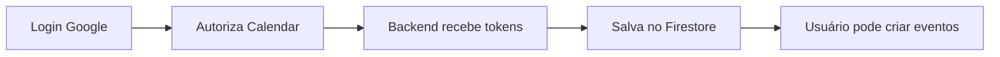

<div align="center">

# 📊 VidaExtra® – Calculadora AC-4

### Aplicação PWA para cálculo profissional de horas extras (AC-4)


</div>

---

## 📑 Índice

- [Sobre o Projeto](#-sobre-o-projeto)
- [Recursos Principais](#-recursos-principais)
- [Tecnologias Utilizadas](#-tecnologias-utilizadas)
- [Início Rápido](#-início-rápido)
- [Configuração](#-configuração)
- [Integração Google Calendar](#-integração-google-calendar)
- [Testes Locais](#-testes-locais)
- [Como Usar](#-como-usar)
- [Scripts Disponíveis](#-scripts-disponíveis)
- [Estrutura do Projeto](#-estrutura-do-projeto)
- [Deploy](#-deploy)
- [Changelog](#-changelog)
- [Contribuindo](#-contribuindo)
- [Suporte](#-suporte)

---

## 📖 Sobre o Projeto

**VidaExtra®** é uma Progressive Web App (PWA) desenvolvida para facilitar o cálculo de horas extras no formato AC-4, voltada para profissionais da segurança pública. A aplicação oferece uma interface intuitiva, cálculos precisos baseados em tabelas configuráveis e recursos avançados como histórico, edição de registros, calendário visual e exportação em PDF.

### 🎯 Objetivo

Simplificar e automatizar o cálculo de horas extras, permitindo aos usuários:

- Registrar operações com data, horários e anotações
- Visualizar histórico completo em lista e calendário
- Aplicar descontos de pensão alimentícia automaticamente
- Exportar relatórios em PDF para prestação de contas
- Acessar offline através da tecnologia PWA

---

## ✨ Recursos Principais

### 📝 Formulário Inteligente

- **Seleção de Data**: Escolha a data do serviço com calendário visual
- **Horários Flexíveis**: Entrada de hora inicial e final (suporte a plantões noturnos)
- **Anotações Personalizadas**: Campo de texto para observações importantes
- **Desconto de Pensão**: Cálculo automático com percentual configurável

### 📊 Cálculos Automáticos

- **Valores por Dia da Semana**: Tabela diferenciada (segunda a domingo)
- **Cálculo de Horas**: Automatizado com suporte a períodos que atravessam meia-noite
- **Descontos**: Aplicação automática de percentual de pensão alimentícia
- **Totalizadores**: Acompanhamento de horas acumuladas e valores (bruto/líquido)

### 📅 Calendário Visual

- **FullCalendar Integrado**: Visualização mensal e semanal dos registros
- **Indicadores Visuais**:
  - Borda azul para eventos de hoje
  - Borda vermelha para eventos futuros
- **Tooltips Informativos**: Hover/toque para ver detalhes sem abrir o registro
- **Responsivo**: Ajuste automático ao alternar entre abas

### 📋 Histórico Completo

- **Lista Ordenada**: Registros organizados por data crescente
- **Edição em Linha**: Modifique data, horários, pensão e anotações
- **Remoção Seletiva**: Delete registros individuais com confirmação
- **Totalizadores Dinâmicos**: Atualização automática de horas e valores
- **Persistência Local**: Dados salvos no navegador (localStorage)

### 📄 Exportação PDF

- **Layout Profissional**: Tabela formatada com cabeçalho e rodapé
- **Informações Completas**: Data, período, anotações, horas e valores
- **Totalizadores**: Horas acumuladas, valores bruto/líquido e descontos
- **Nome Automático**: Arquivo gerado com data no formato `historico_ac4_YYYY-MM-DD.pdf`

### 🎵 Feedback Sonoro

- **Som de Confirmação**: Bip agradável ao adicionar registro
- **Som de Limpeza**: Efeito decrescente ao limpar todos os dados
- **Som de Exclusão**: Bip curto ao remover item individual

### 📱 PWA (Progressive Web App)

- **Instalável**: Adicione à tela inicial do smartphone ou desktop
- **Offline**: Funciona sem internet após primeira carga
- **Service Worker**: Cache inteligente de recursos estáticos
- **Manifest Configurado**: Ícones, cores e orientação otimizados

---

## 🛠️ Tecnologias Utilizadas

### Frontend

| Tecnologia          | Versão | Descrição                                          |
| ------------------- | ------ | -------------------------------------------------- |
| **Bootstrap**       | 5.3.0  | Framework CSS para layout responsivo e componentes |
| **Bootstrap Icons** | 1.10.0 | Biblioteca de ícones para interface                |
| **Tailwind CSS**    | 4.1.16 | Utilitários CSS modernos para estilização          |
| **FullCalendar**    | 6.1.10 | Calendário interativo com eventos                  |
| **Luxon**           | 3.x    | Manipulação e formatação de datas                  |
| **SweetAlert2**     | 11.x   | Modais e diálogos elegantes                        |
| **html2pdf.js**     | 0.10.1 | Geração de PDF a partir de HTML                    |

### Build & Qualidade

| Ferramenta       | Versão  | Descrição                                            |
| ---------------- | ------- | ---------------------------------------------------- |
| **ESLint**       | 9.38.0  | Linter para qualidade e padrões de código JavaScript |
| **PostCSS**      | 8.5.6   | Processador CSS para otimizações                     |
| **Autoprefixer** | 10.4.21 | Adiciona prefixos vendor automaticamente             |
| **Serve**        | 14.2.5  | Servidor HTTP estático para desenvolvimento          |

### PWA

| Recurso            | Descrição                              |
| ------------------ | -------------------------------------- |
| **Service Worker** | Cache offline e estratégia cache-first |
| **Web Manifest**   | Configuração de instalação e aparência |
| **LocalStorage**   | Persistência de dados no navegador     |

---

## � Início Rápido

### Instalação Local

```powershell
# 1. Clone o repositório
git clone https://github.com/Ald3b4r4n/VidaExtra.git
cd VidaExtra

# 2. Instale as dependências
npm install

# 3. Inicie o servidor de desenvolvimento
npm start

# 4. Acesse http://localhost:5500
```

### Deploy na Vercel (Recomendado)

```powershell
# 1. Instale a CLI da Vercel
npm install -g vercel

# 2. Faça o deploy
vercel

# 3. Configure as variáveis de ambiente no dashboard
```

---

## ⚙️ Configuração

### Estrutura Tailwind CSS

O projeto usa Tailwind CSS v4 com compilação via CLI. Os arquivos de configuração são:

#### `tailwind.config.js`

```javascript
module.exports = {
  content: [
    "./index.html",
    "./app.js",
    "./dashboard-preview.html",
    "./dashboard-alt-preview.html",
    "./dashboard-a-preview.html",
  ],
  theme: {
    extend: {
      colors: {
        primary: "#0d6efd",
        success: "#198754",
        danger: "#dc3545",
        warning: "#ffc107",
      },
    },
  },
  plugins: [],
};
```

#### `postcss.config.js`

```javascript
module.exports = {
  plugins: {
    tailwindcss: {},
    autoprefixer: {},
  },
};
```

#### `src/input.css`

```css
@tailwind base;
@tailwind components;
@tailwind utilities;

/* Customizações globais podem ser adicionadas aqui */
```

### Configuração ESLint

O projeto usa ESLint 9 com flat config:

#### `eslint.config.cjs`

```javascript
module.exports = [
  {
    files: ["**/*.js"],
    languageOptions: {
      ecmaVersion: 2021,
      sourceType: "script",
      globals: {
        window: "readonly",
        document: "readonly",
        console: "readonly",
        localStorage: "readonly",
        Swal: "readonly",
        html2pdf: "readonly",
        bootstrap: "readonly",
      },
    },
    rules: {
      "no-unused-vars": ["warn", { args: "none" }],
      "no-console": "off",
      semi: ["error", "always"],
      quotes: ["warn", "single"],
    },
  },
];
```

#### `.eslintignore`

```
node_modules/
dist/
*.min.js
```

### Valores AC-4

Os valores por dia da semana são configurados em `valores-ac4.json`:

```json
{
  "valores": [
    {
      "horario": "18h as 00h (6h)",
      "horas": 6,
      "segunda": 279.4,
      "terca": 279.4,
      "quarta": 279.4,
      "quinta": 279.4,
      "sexta": 279.4,
      "sabado": 344.9,
      "domingo": 417.07
    }
    // ... mais horários
  ]
}
```

**Campos:**

- `horario`: Formato de exibição (aceita `_` ou espaços)
- `horas`: Total de horas do período
- `segunda` a `domingo`: Valores monetários por dia da semana

---

## 📖 Como Usar

### Iniciando o Servidor

```powershell
# Opção 1: Usando npm start
npm start

# Opção 2: Diretamente com serve
npm run serve

# O servidor iniciará na porta 5500
# Acesse: http://localhost:5500
```

### Fluxo de Uso

#### 1. **Adicionar um Cálculo**

<div align="center">



</div>

1. Selecione a **data** do serviço
2. Informe a **hora inicial** (ex: 18:00)
3. Informe a **hora final** (ex: 00:00)
4. _(Opcional)_ Marque "Pensão Alimentícia" e informe o percentual
5. _(Opcional)_ Adicione anotações (local, tipo de operação, etc.)
6. Clique em **"Calcular"**
7. Visualize o resultado na aba "Resultado"
8. O registro é adicionado automaticamente ao histórico

#### 2. **Visualizar Histórico**

- **Lista**: Todos os registros ordenados por data crescente
- **Calendário**: Clique na aba "Histórico" para ver a visualização mensal/semanal
- **Tooltips**: Passe o mouse (ou toque em mobile) sobre os dias com eventos

#### 3. **Editar um Registro**

1. Localize o item no histórico
2. Clique no **ícone de lápis** (📝)
3. Modifique os campos desejados
4. Clique em **"Salvar"**
5. Os totais são recalculados automaticamente

#### 4. **Remover um Registro**

1. Localize o item no histórico
2. Clique no **ícone X** (✖️)
3. Confirme a remoção
4. Os totais são atualizados automaticamente

#### 5. **Exportar PDF**

1. Certifique-se de ter registros no histórico
2. Clique em **"Exportar PDF"**
3. Aguarde a geração
4. O arquivo será baixado automaticamente com nome `historico_ac4_YYYY-MM-DD.pdf`

#### 6. **Limpar Tudo**

1. Clique em **"Limpar Tudo"**
2. Confirme a ação
3. Todos os dados (resultado + histórico) serão apagados

---

## 📜 Scripts Disponíveis

### Scripts de Build

```powershell
# Compilar Tailwind CSS (minificado para produção)
npm run build:css

# Compilar Tailwind CSS em modo watch (desenvolvimento)
npm run dev:css
```

### Scripts de Servidor

```powershell
# Iniciar servidor estático na porta 5500
npm run serve

# Alias para npm run serve
npm start
```

### Scripts de Qualidade

```powershell
# Executar ESLint em todos os arquivos .js
npm run lint

# Executar ESLint com correção automática
npm run lint -- --fix
```

### Scripts Automáticos

```powershell
# Executado automaticamente após npm install
npm run postinstall  # = npm run build:css
```

---

## 📂 Estrutura do Projeto

```
VidaExtra/
│
├── 📁 src/
│   └── input.css                    # Arquivo fonte Tailwind
│
├── 📁 dist/
│   └── tailwind.css                 # CSS compilado e minificado
│
├── 📁 node_modules/                 # Dependências (não versionado)
│
├── 📄 index.html                    # Página principal da aplicação
├── 📄 app.js                        # Lógica principal (ES2021)
├── 📄 style.css                     # Estilos customizados complementares
│
├── 📄 dashboard-preview.html        # Preview alternativo 1
├── 📄 dashboard-alt-preview.html    # Preview alternativo 2
├── 📄 dashboard-a-preview.html      # Preview alternativo 3
├── 📄 index.backup-opcaoA.html      # Backup de versão anterior
│
├── 📄 valores-ac4.json              # Tabela de valores por dia/horário
│
├── 📄 manifest.json                 # Manifesto PWA
├── 📄 sw.js                         # Service Worker
│
├── 📄 package.json                  # Configuração do projeto e dependências
├── 📄 package-lock.json             # Lock de versões das dependências
│
├── 📄 tailwind.config.js            # Configuração Tailwind CSS
├── 📄 postcss.config.js             # Configuração PostCSS
├── 📄 eslint.config.cjs             # Configuração ESLint (flat config)
│
└── 📄 README.md                     # Este arquivo
```

### Arquivos Principais

#### `index.html`

Página principal da aplicação com:

- Importação de bibliotecas via CDN (Bootstrap, FullCalendar, etc.)
- Estrutura HTML semântica
- Sistema de abas (Cálculo, Resultado, Histórico)
- Links para folhas de estilo

#### `app.js`

Código principal com:

- Carregamento de valores do JSON
- Funções de cálculo de horas extras
- Gerenciamento de histórico (adicionar, editar, remover)
- Integração com FullCalendar
- Geração de PDF
- Persistência em localStorage
- Feedback sonoro

#### `valores-ac4.json`

Tabela de valores configurável:

- Horários pré-definidos
- Valores diferenciados por dia da semana
- Total de horas por período

#### `sw.js` (Service Worker)

Estratégia de cache:

- Cache-first para recursos estáticos
- Atualização em background
- Suporte offline

---

## 🔍 Qualidade de Código

### Padrões ESLint

O projeto segue o `eslint:recommended` com adaptações:

- **ECMAVersion**: ES2021
- **SourceType**: Script (compatível com browsers)
- **Globals**: `Swal`, `html2pdf`, `bootstrap`, `FullCalendar`, `luxon`
- **Rules**:
  - `no-unused-vars`: Aviso (permite parâmetros não usados)
  - `no-console`: Desligado (permite logs)
  - `semi`: Erro (exige ponto-e-vírgula)
  - `quotes`: Aviso (prefere aspas simples)

### Executando Validação

```powershell
# Verificar erros e avisos
npm run lint

# Corrigir problemas automaticamente
npm run lint -- --fix
```

### Boas Práticas

- ✅ Usar `const` e `let` (evitar `var`)
- ✅ Nomear funções e variáveis de forma descritiva
- ✅ Comentar seções e lógicas complexas
- ✅ Evitar aninhamento excessivo (máx 3 níveis)
- ✅ Validar inputs do usuário
- ✅ Tratar erros com try/catch
- ✅ Usar arrow functions quando apropriado

---

## 📅 Integração Google Calendar & Sistema de Emails

### 🎯 Visão Geral

O VidaExtra oferece integração completa com **Google Calendar** e **sistema de emails automáticos**:

- ✅ Criar eventos automaticamente ao calcular AC-4
- ✅ Sincronizar com Google Calendar nativo em tempo real
- ✅ Receber lembretes por email (Google Calendar: 24h, 1h) e popup (30min, 15min)
- ✅ Emails personalizados (boas-vindas, confirmação, relatório mensal)
- ✅ Relatórios mensais automáticos com estatísticas
- ✅ Sistema de doações PIX integrado

### 🔐 Configuração OAuth (Obrigatória)

#### 1. Google Cloud Console - Redirect URI

⚠️ **IMPORTANTE:** Configure o Redirect URI ou receberá erro `redirect_uri_mismatch`

1. Acesse [Google Cloud Console](https://console.cloud.google.com/apis/credentials)
2. Selecione/crie projeto → Habilite **Google Calendar API**
3. Crie credenciais **OAuth 2.0** (Web application)
4. **Adicione URIs de redirecionamento autorizados:**
   - **Desenvolvimento:** `http://localhost:5500/pages/oauth2callback.html`
   - **Produção:** `https://seu-app.vercel.app/pages/oauth2callback.html`
5. Salve e aguarde 1-2 minutos para propagar

#### 2. Variáveis de Ambiente

Configure no `.env.local` (desenvolvimento) ou no Dashboard Vercel (produção):

```bash
# OAuth Google Calendar
OAUTH_CLIENT_ID=286306256976-hg93orc4eg18phng4gs68fcsrpmun2c4.apps.googleusercontent.com
OAUTH_CLIENT_SECRET=seu-client-secret

# Firebase Admin SDK
FIREBASE_SERVICE_ACCOUNT_KEY={"type":"service_account","project_id":"..."}
FIREBASE_PROJECT_ID=vidaextra-ac4

# SMTP (Nodemailer para emails customizados)
SMTP_HOST=smtp.gmail.com
SMTP_PORT=465
SMTP_SECURE=true
SMTP_USER=seu-email@gmail.com
SMTP_PASS=sua-senha-de-app  # https://myaccount.google.com/apppasswords

# App URL
APP_URL=https://vidaextra-calculadora-ac4.vercel.app

# Cron Security (opcional - protege relatórios mensais)
CRON_SECRET=sua-chave-secreta-aleatoria
```

### 📧 Sistema de Emails Híbrido

O VidaExtra usa **dois sistemas** de email trabalhando em conjunto:

#### 1️⃣ Google Calendar API (Lembretes Agendados)

**Gerenciado 100% pelo Google** - Zero manutenção!

**Como funciona:**

1. VidaExtra cria evento no Google Calendar com lembretes pré-configurados
2. Google Calendar **armazena nos servidores** deles (24/7)
3. Google **envia emails automaticamente** nos horários programados:
   - 📧 **24 horas antes** do evento (email)
   - 📧 **1 hora antes** do evento (email)
   - 🔔 **30 minutos antes** (popup no celular/navegador)
   - 🔔 **15 minutos antes** (popup no celular/navegador)
4. **Funciona mesmo com app fechado** (gerenciado pelo Google)

✅ **Benefícios:**

- Confiabilidade 99.9%
- Sem custo de infraestrutura
- Sincroniza em todos os dispositivos
- Backup automático na nuvem

#### 2️⃣ Nodemailer (Emails Imediatos Personalizados)

**Vercel Serverless Functions** - Emails customizados com design VidaExtra®

##### 📧 Email de Boas-Vindas (`/api/sendWelcomeEmail`)

- **Quando:** Primeiro login do usuário
- **Disparo:** Automático via `src/auth.js` (detecta `localStorage`)
- **Conteúdo:**
  - Mensagem personalizada de boas-vindas
  - Lista de funcionalidades do app
  - Dicas para começar
  - Botão "Começar Agora"
  - **Botão PIX** para doações ☕

##### ✅ Email de Confirmação (`/api/sendEventConfirmation`)

- **Quando:** Imediatamente após criar evento no Calendar
- **Disparo:** Automático via `app.js` (após `createCalendarEvent`)
- **Conteúdo:**
  - Badge verde de confirmação ✅
  - Detalhes completos do evento (data, hora, descrição)
  - Lista de lembretes configurados
  - Botão "Abrir no Google Calendar"
  - **Botão PIX** para doações ☕

##### 📊 Relatório Mensal (`/api/sendMonthlyReport`)

- **Quando:** **Todo dia 1 de cada mês às 00:00 UTC**
- **Disparo:** **Vercel Cron Job** automático (via `vercel.json`)
- **Conteúdo:**
  - Cards visuais com estatísticas do mês anterior
  - Total de eventos, horas trabalhadas
  - Valores bruto e líquido acumulados
  - Tabela detalhada de todos os eventos
  - Botão "Ver Histórico Completo"
  - **Botão PIX** para doações ☕

**Design dos emails:**

- ✨ Gradientes VidaExtra® (roxo, verde, azul)
- 📱 Layout responsivo (mobile + desktop)
- 💜 Botão PIX em todos os emails
- 🎨 Profissional e consistente

### 🛠️ API Endpoints

| Endpoint                     | Método | Descrição                      | Uso                          |
| ---------------------------- | ------ | ------------------------------ | ---------------------------- |
| `/api/createCalendarEvent`   | POST   | Cria evento no Google Calendar | app.js → Cálculo AC-4        |
| `/api/getUpcomingEvents`     | GET    | Lista próximos eventos         | reminders.js → Aba Lembretes |
| `/api/exchangeCodeForTokens` | POST   | Troca código OAuth por tokens  | oauth2callback.html → Login  |
| `/api/sendWelcomeEmail`      | POST   | Envia boas-vindas              | auth.js → Primeiro login     |
| `/api/sendEventConfirmation` | POST   | Confirma evento criado         | app.js → Após criar evento   |
| `/api/sendMonthlyReport`     | POST   | Gera relatório mensal          | Vercel Cron → Dia 1          |
| `/api/ping`                  | GET    | Health check                   | Monitoramento                |

### 📊 Fluxo OAuth Completo

```
1. Login Firebase Auth (Google)
   ↓
2. Usuário autenticado no app
   ↓
3. Clicar "Conectar Google Calendar"
   ↓
4. Redireciona para Google OAuth (tela de consentimento)
   ↓
5. Autoriza acesso ao Calendar
   ↓
6. Google redireciona para /pages/oauth2callback.html
   ↓
7. Troca código por tokens (POST /api/exchangeCodeForTokens)
   ↓
8. Salva no Firestore: accessToken + refreshToken
   ↓
9. Salva no localStorage: accessToken (uso imediato)
   ↓
10. Usuário pode criar eventos! ✅
```

**Tokens:**

- `accessToken`: Válido por **1 hora** (renova automaticamente)
- `refreshToken`: **Permanente** até revogação
- Armazenamento: **Firestore** (persistente) + **localStorage** (cache)

### ☕ Sistema de Doações PIX

#### Página Dedicada: `/pages/pix-cafe.html`

Design profissional para doações:

- 🎨 Gradiente roxo VidaExtra®
- 📋 Código PIX Copia e Cola visível
- 🖱️ Botão copiar com feedback visual
- 📱 Responsivo (mobile + desktop)
- 💳 Instruções passo a passo

**Código PIX:**

```
00020126580014BR.GOV.BCB.PIX0136b5baaa1b-8488-46ea-b22e-65a3c4b2e8925204000053039865802BR5925Antonio Rafael Souza Cruz6009SAO PAULO62140510tKFbsrxeJm6304B33A
```

**Titular:** Antonio Rafael Souza Cruz  
**Chave:** b5baaa1b-8488-46ea-b22e-65a3c4b2e892

#### Integração nos Emails

Todos os 3 tipos de email (boas-vindas, confirmação, relatório) incluem:

- 💜 **Botão verde**: "Pague-me um Café via PIX"
- 🔗 **Link**: Direciona para `/pages/pix-cafe.html`
- 🎯 **Call to action** emocional (coração animado)

### 🔒 Segurança

- ✅ **Tokens OAuth** criptografados no Firestore
- ✅ **Firestore Rules**: Cada usuário acessa apenas seus dados
- ✅ **Firebase ID tokens** validados em cada requisição
- ✅ **HTTPS obrigatório** em produção (Vercel)
- ✅ **Cron Jobs** protegidos com `CRON_SECRET`
- ✅ **Refresh automático** de access tokens (sem re-autenticação)
- ✅ **Senhas de app Gmail** (não senha real)

**Firestore Security Rules:**

```javascript
rules_version = '2';
service cloud.firestore {
  match /databases/{database}/documents {
    match /users/{userId} {
      allow read, write: if request.auth != null && request.auth.uid == userId;
    }
  }
}
```

### 🗓️ Vercel Cron Jobs

Configuração em `vercel.json`:

```json
{
  "crons": [
    {
      "path": "/api/sendMonthlyReport",
      "schedule": "0 0 1 * *" // Todo dia 1 às 00:00 UTC
    }
  ]
}
```

**Funcionamento:**

1. Vercel executa função automaticamente
2. Busca todos os usuários do Firestore
3. Para cada usuário:
   - Busca eventos do mês anterior em `users/{uid}/history`
   - Calcula totais (horas, valores bruto/líquido)
   - Gera email com estatísticas + tabela
   - Envia via Nodemailer (SMTP)
4. Retorna log: `{ reportsSent: 10, errors: [] }`

⚠️ **Nota:** Para relatórios funcionarem, implemente salvamento de eventos no Firestore (atualmente só localStorage).

### 📱 Acesso Multiplataforma

Seus eventos AC-4 sincronizam automaticamente em:

- 🌐 **Web**: https://calendar.google.com
- 📱 **Android**: App Google Calendar
- 🍎 **iOS**: App Google Calendar
- 💻 **Desktop**: Thunderbird, Outlook (sincronize conta Google)
- ⌚ **Smartwatch**: Wear OS, Apple Watch

### 🧪 Testes Locais

#### Scripts de teste disponíveis:

```powershell
# Email de boas-vindas
node test-welcome-email.js

# Email de confirmação de evento
node test-confirmation-email.js

# Relatório mensal
node test-monthly-report-email.js

# Criar evento no Calendar (requer User ID)
node test-calendar-event.js OtYUUQtqXDMLirjUHz9cZR87ays2

# Versão simplificada (usa token direto)
node test-calendar-simple.js
```

#### Servidor de desenvolvimento:

```powershell
# Inicia dev-server.js na porta 5500
npm start

# ou diretamente
node dev-server.js
```

**Endpoints locais disponíveis:**

- `http://localhost:5500/api/exchangeCodeForTokens`
- `http://localhost:5500/api/createCalendarEvent`
- `http://localhost:5500/api/getUpcomingEvents`

### ❓ Troubleshooting

#### "redirect_uri_mismatch"

**Solução:** Adicione `http://localhost:5500/pages/oauth2callback.html` no Google Cloud Console

#### "Tokens não salvam no Firestore"

**Solução:**

1. Certifique-se de criar banco Firestore no Firebase Console
2. Configure Security Rules para permitir escrita

#### "Email não chegou"

**Solução:**

1. Verifique pasta Spam/Lixo Eletrônico
2. Confirme SMTP_USER e SMTP_PASS corretos
3. Verifique logs do terminal/Vercel

#### "Relatório mensal não disparou"

**Solução:**

1. Aguarde até dia 1 do mês (00:00 UTC)
2. Verifique logs no Vercel Dashboard → Functions → Logs
3. Confirme `CRON_SECRET` configurado (se estiver usando)

### 🔐 Configuração Rápida

#### 1. Google Cloud Console

1. Acesse [Google Cloud Console](https://console.cloud.google.com/)
2. Crie/selecione projeto
3. Habilite **Google Calendar API**
4. Crie credenciais OAuth 2.0:
   - Tipo: Web application
   - Origens autorizadas: `http://localhost:5500`, `https://seu-dominio.vercel.app`
   - URIs de redirecionamento: `/oauth2callback`

#### 2. Firebase/Vercel Setup

**Se usar Firebase:**

```powershell
# Arquivo functions/.env
OAUTH_CLIENT_ID=seu-client-id
OAUTH_CLIENT_SECRET=seu-secret
FIREBASE_PROJECT_ID=seu-projeto
```

**Se usar Vercel:**

```powershell
# Configure no dashboard Vercel > Settings > Environment Variables
OAUTH_CLIENT_ID=seu-client-id
OAUTH_CLIENT_SECRET=seu-secret
FIREBASE_PROJECT_ID=seu-projeto
```

### 📧 Sistema de Notificações

#### E-mail (via Nodemailer)

Configure SMTP no arquivo de ambiente:

```bash
SMTP_SERVICE=gmail
SMTP_HOST=smtp.gmail.com
SMTP_PORT=465
SMTP_SECURE=true
SMTP_USER=seu-email@gmail.com
SMTP_PASS=sua-senha-de-app  # Gere em https://myaccount.google.com/apppasswords
```

#### Lembretes Automáticos

O sistema envia notificações:

- 📧 **24 horas** antes do evento
- 📧 **1 hora** antes do evento
- 🔔 **30 minutos** antes (popup no Google Calendar)

### �️ API Endpoints

| Endpoint                   | Método | Descrição                      |
| -------------------------- | ------ | ------------------------------ |
| `/api/createCalendarEvent` | POST   | Cria evento no Google Calendar |
| `/api/getUpcomingEvents`   | GET    | Lista próximos eventos         |
| `/api/registerCredentials` | POST   | Salva tokens OAuth             |
| `/api/ping`                | GET    | Health check                   |

### 📊 Fluxo de Autenticação



### 🔒 Segurança

- ✅ Tokens OAuth armazenados no Firestore
- ✅ Firestore Rules: usuário acessa apenas seus dados
- ✅ ID tokens Firebase validados em cada requisição
- ✅ HTTPS obrigatório em produção

Para documentação completa, consulte [CHANGELOG.md](./CHANGELOG.md).

---

## 🧪 Testes Locais

Antes de fazer deploy, teste as funcionalidades localmente:

📖 **[Guia Completo de Testes Locais](./TESTES_LOCAIS.md)**

### Testes Disponíveis

1. **E-mail de Lembrete** (template HTML completo):

   ```powershell
   node test-reminder-email.js
   ```

2. **Criação de Evento no Google Calendar**:

   ```powershell
   node test-calendar-event.js <USER_ID>
   ```

3. **Vercel Functions Localmente**:
   ```powershell
   vercel dev
   ```

**Pré-requisitos:**

- Criar `.env.local` com credenciais reais
- Configurar Firebase Service Account
- Gerar senha de app do Gmail
- Obter OAuth Client ID/Secret

Consulte [TESTES_LOCAIS.md](./TESTES_LOCAIS.md) para instruções detalhadas.

---

## 🆕 Novidades Recentes

### Versão 1.0.0 (Novembro 2024)

#### 🎨 Melhorias no Calendário

- ✨ Eventos no mês aparecem como **texto simples** por dia (sem barras atravessando)
- 🎨 **Borda visual** nos dias com eventos:
  - **Azul** para eventos de hoje
  - **Vermelho** para eventos futuros
- 🌐 Rótulos totalmente em **português**: `mês`, `semana`, `hoje`
- 🔧 Correção de renderização ao alternar para aba Histórico (recalcula tamanho)

#### 📝 Funcionalidade de Edição

- ✏️ **Edição completa** de registros do histórico
- 🔄 Recálculo automático de totais após edição
- 💾 Atualização em tempo real no calendário e lista

#### 🎵 Feedback Sonoro

- 🔔 Som de confirmação ao adicionar cálculo
- 🧹 Som de limpeza ao resetar dados
- 🗑️ Som de exclusão ao remover item

#### 🐛 Correções

- 🔧 Overflow de texto nos quadrados do calendário
- 🔧 Sincronização entre lista e calendário
- 🔧 Persistência de dados após edição
- 🔧 Formatação de horários no JSON (aceita `_` e espaços)

---

## 🤝 Contribuindo

Contribuições são bem-vindas! Para contribuir:

### 1. Fork o repositório

```powershell
# No GitHub, clique em "Fork"
```

### 2. Clone seu fork

```powershell
git clone https://github.com/SEU-USUARIO/VidaExtra.git
cd VidaExtra
```

### 3. Crie uma branch para sua feature

```powershell
git checkout -b feature/minha-nova-feature
```

### 4. Faça suas alterações

```powershell
# Edite os arquivos
npm run lint          # Verifique a qualidade
npm run build:css     # Compile o CSS se necessário
```

### 5. Commit e Push

```powershell
git add .
git commit -m "feat: adiciona nova funcionalidade X"
git push origin feature/minha-nova-feature
```

### 6. Abra um Pull Request

- No GitHub, vá até seu fork
- Clique em "New Pull Request"
- Descreva suas alterações detalhadamente

### Diretrizes

- ✅ Mantenha o código limpo e documentado
- ✅ Siga os padrões ESLint do projeto
- ✅ Teste suas alterações antes do commit
- ✅ Use commits semânticos (`feat:`, `fix:`, `docs:`, `style:`, `refactor:`)
- ✅ Não inclua `node_modules` ou `dist` no commit
- ✅ Atualize o README se adicionar novos recursos

---

## 💬 Suporte

### Problemas Comuns

#### ❓ "Horário não encontrado"

**Solução**: Verifique se o horário existe em `valores-ac4.json`. O formato deve ser exato (ex: `18h as 00h`).

#### ❓ "Valores não carregados"

**Solução**: Certifique-se de que o arquivo `valores-ac4.json` está na raiz do projeto e é um JSON válido.

#### ❓ Tailwind CSS não aplica estilos

**Solução**: Execute `npm run build:css` para gerar o arquivo `dist/tailwind.css`.

#### ❓ Erros de ESLint

**Solução**: Execute `npm run lint -- --fix` para corrigir automaticamente.

#### ❓ PWA não instala

**Solução**: Certifique-se de estar acessando via HTTPS ou localhost. Verifique o console do navegador.

### Contato

- **Desenvolvedor**: CB Antônio Rafael - 14ª CIPM
- **GitHub**: [Ald3b4r4n](https://github.com/Ald3b4r4n)
- **Repositório**: [VidaExtra](https://github.com/Ald3b4r4n/VidaExtra)

---

## 🏆 Créditos

### Desenvolvedor Principal

- **CB Antônio Rafael** - Desenvolvedor Full Stack
- Lotação: 14ª CIPM

### Tecnologias de Terceiros

Este projeto utiliza as seguintes bibliotecas open-source:

- [Bootstrap](https://getbootstrap.com/) - Framework CSS
- [Bootstrap Icons](https://icons.getbootstrap.com/) - Ícones
- [Tailwind CSS](https://tailwindcss.com/) - Utilitários CSS
- [FullCalendar](https://fullcalendar.io/) - Calendário interativo
- [Luxon](https://moment.github.io/luxon/) - Manipulação de datas
- [SweetAlert2](https://sweetalert2.github.io/) - Modais elegantes
- [html2pdf.js](https://ekoopmans.github.io/html2pdf.js/) - Geração de PDF
- [ESLint](https://eslint.org/) - Linter JavaScript
- [PostCSS](https://postcss.org/) - Processador CSS
- [Serve](https://github.com/vercel/serve) - Servidor estático

### Agradecimentos

- Comunidade open-source por disponibilizar ferramentas incríveis
- Colegas da 14ª CIPM pelos feedbacks e testes
- Usuários finais que utilizam e confiam na aplicação

---

## 📄 Licença

**Uso Interno** - Sem licença pública definida.

Este projeto é desenvolvido para uso interno da instituição.
Todos os direitos reservados © 2024 VidaExtra®

---

<div align="center">

### ⭐ Se este projeto foi útil, considere dar uma estrela no GitHub!

**[⬆️ Voltar ao topo](#-vidaextra--calculadora-ac-4)**

Desenvolvido com ❤️ por **CB Antônio Rafael**

</div>
